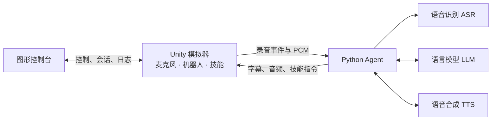

<p align="center">
  <a href="https://github.com/AgiBot-Community">
    
  </a>
</p>

<h1 align="center">X2 Agent Playground</h1>

<p align="center">
  <a href="README.md"></a>
  <a href="docs/en/README.md"></a>
  <a href="docs/fr/README.md"></a>
</p>

<p align="center">
  基于 Unity 的 X2 人形机器人仿真环境，提供 WebSocket 网关、机器人技能、Python 语音 Agent 和图形控制台。
</p>

<p align="center"><a href="https://unity.com/releases/editor/archive"></a> <a href="https://learn.microsoft.com/dotnet/csharp/"></a> <a href="https://www.python.org/"></a> <a href="LICENSE"></a> <a href="https://github.com/AgiBot-Community"></a> <a href="https://github.com/AgiBot-Community/Unity-Agent-Playground/issues"></a></p>

[快速开始](#快速开始) · [配置与技能](#配置与技能) · [操作与调试](#操作与调试) · [常见问题](#常见问题) · [开发与构建](#开发与构建) · [文档](#文档)

## 项目介绍

Unity 采集麦克风音频、显示机器人并执行技能。Agent 通过 WebSocket 接收音频，调用语音识别（ASR）、大语言模型（LLM）和语音合成（TTS），将文字、音频与技能指令发回模拟器。示例 Agent 使用豆包语音服务和火山方舟，也可以按[网关协议](docs/zh-CN/interface.md)接入其他客户端。

- **机器人技能**：挥手、张臂、行走、转向和表情，支持执行状态回报与显式打断。
- **语音交互**：流式识别、模型回复和语音合成；离线 demo 可验证连接与音频播放。
- **管理与调试**：图形控制台提供手动控制、会话优先级、状态监控和日志导出。
- **源码与构建**：包含 Unity 工程、独立 Python 示例和 Windows 单文件打包工具。



模拟器、Agent 和控制台是独立进程。只测试动作时运行模拟器即可；语音对话需要 Agent；查看日志、调整优先级或手动控制时可同时运行控制台。

## 快速开始

| 运行方式 | 环境要求 |
|---|---|
| 便携模拟器 | Windows 10/11 x64 |
| Unity 源码 | Unity Hub 和 **2022.3.62f3c1** 编辑器 |
| Python Agent / 控制台 | Python 3.10+；控制台还需要 Tkinter |
| 语音对话 | 麦克风、扬声器、火山引擎语音与方舟 API Key |

### 获取源码

仅运行便携模拟器可以直接下载 EXE。使用 Python 示例、控制台或 Unity 工程时，先克隆仓库，也可以下载源码 ZIP 后完整解压：

```powershell
git clone https://github.com/AgiBot-Community/Unity-Agent-Playground.git
cd Unity-Agent-Playground
```

下文命令使用 Windows PowerShell，除特别说明外均从仓库根目录执行。安装依赖和运行脚本应使用同一个 Python 环境。

### 1. 启动模拟器

**方式 A：Windows 便携版**

1. 从 [GitHub Releases](https://github.com/AgiBot-Community/Unity-Agent-Playground/releases) 下载 `x2-simulator-windows-x64.exe` 和同版本的 `.sha256` 文件。
2. 在下载目录打开 PowerShell，计算校验值，与 `.sha256` 文件中的值比较：

   ```powershell
   Get-FileHash -LiteralPath '.\x2-simulator-windows-x64.exe' -Algorithm SHA256
   ```

3. 双击 EXE，等待机器人窗口出现。首次运行会将资源解压到 `%LOCALAPPDATA%\UnityPortable`，后续启动复用缓存。
4. 按 **F1** 打开调试面板，用技能按钮测试动作。此时无需 Python 或云服务密钥。

**方式 B：Unity 源码**

1. 安装 Unity Hub 和 **2022.3.62f3c1** 编辑器，版本记录见 [ProjectVersion.txt](unity-agent-playground/ProjectSettings/ProjectVersion.txt)。下载与安装步骤见 [Unity 工程指南](docs/zh-CN/unity.md)。
2. 在 Hub 中选择 **Add project from disk**，添加内层 `unity-agent-playground/`，该目录包含 `Assets/`、`Packages/` 和 `ProjectSettings/`。
3. 等待依赖导入与编译，打开 `Assets/X02Competition/Scenes/scene.unity`，点击 **Play**。
4. 点击 Game 窗口后按 **F1** 查看状态；再次点击 Play 可停止场景。

两种方式默认监听 `127.0.0.1:9002`，同一时间只运行一个模拟器。

### 2. 验证 Agent 连接

保持机器人运行，在仓库根目录打开 PowerShell：

```powershell
cd example/x2_agent
python -m pip install -r requirements.txt
python demo.py
```

看到 `state=online` 后，等开场白结束再说话，确认字幕和音频播放正常。demo 返回固定文字并播放内置录音，不调用云服务，也不识别语音指令；录音缺失或格式不符时播放提示音。按 **Ctrl+C** 退出。

### 3. 配置语音对话

按 **Ctrl+C** 退出 demo，在同一个 `example/x2_agent/` 终端中执行：

```powershell
if (-not (Test-Path .env)) { Copy-Item .env.example .env }
# 编辑 .env，填写 DOUBAO_SPEECH_API_KEY 和 ARK_API_KEY
python agent.py
```

等待开场白结束后，可以说“你好”“挥挥手”“往前走一米”。模型、音色、参数和排障方法见 [Agent 指南](example/x2_agent/docs/zh-CN/README.md)。

`DOUBAO_SPEECH_API_KEY` 用于 ASR 与 TTS，`ARK_API_KEY` 用于 LLM；对应账号需开通相应服务。配置文件保存在 `example/x2_agent/.env`，不要将密钥提交到 Git。

### 图形控制台（可选）

在仓库根目录的另一个终端中运行：

```powershell
python -m pip install -r example/x2_console/requirements.txt
python example/x2_console/main.py
```

控制台默认只监控；勾选“控制台接管动作”后可手动控制机器人。若要使用“启动模拟器”按钮，将下载的 EXE 保存为仓库下的 `exe/x2模拟器.exe`。操作说明见[控制台指南](docs/zh-CN/console.md)。

1. 保持模拟器运行，在控制台中使用 `127.0.0.1:9002` 连接网关。
2. 在“机器人控制”中操作技能前，先在“会话 / 优先级”勾选接管。
3. 使用语音 Agent 控制动作时取消接管。控制台仍保留日志查看和优先级管理。

控制台管理优先级固定为 `1000`，其他客户端可调整为 `0–999`。会话优先级在重新连接后恢复默认值；动作控制权和麦克风接收权分别管理。

## 配置与技能

Agent 默认读取自身项目目录的 `.env`。下表配置项的优先级为：**命令行参数 > 已有环境变量 > `.env` > 内置默认值**。配置模板见 [`.env.example`](example/x2_agent/.env.example)。

| 配置项 | 用途 |
|---|---|
| `DOUBAO_SPEECH_API_KEY` | ASR / TTS 凭据，语音 Agent 必填 |
| `ARK_API_KEY` | LLM 凭据，语音 Agent 必填 |
| `DOUBAO_LLM_MODEL` | 模型 ID 或方舟接入点 ID |
| `DOUBAO_TTS_SPEAKER` | 与所用 TTS 资源匹配的音色 |
| `DOUBAO_ASR_RESOURCE_ID` | ASR 资源 ID |

在 `example/x2_agent/` 中运行：

```powershell
# 查看完整参数
python agent.py --help
# 自定义或关闭开场白
python agent.py --greeting "你好，我是导览机器人"
python agent.py --greeting=
# 保存输入和回复音频，便于排查设备与合成问题
python agent.py --save-input input.wav --save-audio reply.wav
# 不调用云服务，直接测试挥手
python demo.py --skill gesture/wave_hands
```

| 语音请求示例 | 技能 | 行为 |
|---|---|---|
| “挥挥手”“张开双臂” | `gesture/wave_hands`、`gesture/open_arms` | 播放手势 |
| “往前走一米” | `movement/walk` | 按 `distanceM` 前进 |
| “向右转” | `movement/turn` | 按 `angleDeg` 转向，正值向右 |
| “做个开心的表情” | `emotion/happy` | 切换头部表情 |
| “停” | `movement/stop` | 语音识别并下发技能后停止运动 |

语音请求由 `agent.py` 中的模型选择技能。demo 只能用参数测试技能，不能理解语音请求。技能异步执行，通过 `running`、`done`、`failed` 回报状态；完整参数与表情列表见[网关协议](docs/zh-CN/interface.md)。

## 操作与调试

| 快捷键 | 操作 |
|---|---|
| **F1** | 显示或隐藏 Unity 调试面板 |
| **C** | 轮换视角 |
| **F2 / F3 / F4** | 全景 / 正面跟随 / 侧面跟随 |
| **F5** | 自由环绕；右键拖动旋转，滚轮调节距离 |
| **Ctrl+.**（控制台） | 停止动作与播报 |
| **Ctrl+L**（控制台） | 搜索日志 |

Unity 的运行时日志通过同一 WebSocket 发往客户端。控制台支持级别、来源和关键词筛选，以及 JSONL 导出；Agent 和 demo 在终端显示日志。关闭模拟器窗口或停止 Editor Play 可结束仿真，按 Ctrl+C 停止 Agent。

## 常见问题

| 现象 | 检查方法 |
|---|---|
| 连接被拒绝 | 确认模拟器已运行或 Editor 正在 Play，核对 `127.0.0.1:9002`，关闭争用端口的其他实例 |
| 握手 `401` / `503` | `401` 检查签名凭据和时间戳；`503` 表示连接数达到上限 |
| 有语音回复但没有动作 | 检查控制台是否接管、Agent 是否持有动作控制权，以及日志中的 `4091` |
| 没有识别或播放声音 | 检查系统输入输出设备、音量和静音状态，结合 `--save-input`、`--save-audio` 排查 |
| 播报时说“停”没有响应 | 半双工模式下语音检测暂停，使用控制台停止按钮或显式打断指令 |
| 控制台找不到 EXE | 将下载的模拟器保存为 `exe/x2模拟器.exe`，或手动启动后连接 |

跨机连接需修改 Unity 网关监听地址，并保证端口可达；仅给 Agent 添加 `--host` 不会改变网关的监听范围。详细排障见 [Agent 指南](example/x2_agent/docs/zh-CN/README.md)与 [Unity 工程指南](docs/zh-CN/unity.md)。

## 运行限制

- 语音为半双工：录音提交后，识别、生成回复和播报期间暂停语音检测，回答结束后恢复聆听。停止等待或播报需要显式打断指令或控制台操作；回复连续 90 秒无进展时自动恢复聆听。
- 网关默认接受 8 路连接，麦克风只发送给选中的语音客户端。控制台可调整其他客户端的优先级。
- 默认音色和提示词使用中文。文档提供中、英、法三个版本，语音服务和 Unity 界面有各自的语言支持范围。
- 本项目提供仿真环境；连接真机前需确认设备支持的协议与技能。

## 仓库结构

| 路径 | 内容 |
|---|---|
| [unity-agent-playground/](unity-agent-playground/) | Unity 工程、机器人模型、技能和网关 |
| [example/x2_agent/](example/x2_agent/docs/zh-CN/README.md) | Python 语音 Agent、离线 demo 和测试 |
| [example/x2_console/](example/x2_console/README.md) | Python 图形控制台和测试 |
| [tools/unity-packager/](tools/unity-packager/README.md) | Windows 单文件打包工具 |
| [docs/](docs/README.md) | 使用指南、协议参考和开发文档 |

便携 EXE 和校验文件通过 GitHub Releases 分发；`exe/`、`build/`、`release/` 用于本地下载和构建产物。

## 开发与构建

安装对应 Python 依赖后，在仓库根目录运行测试：

```powershell
cd example/x2_agent
python -B -m unittest discover -s tests -v
cd ../x2_console
python -B -m unittest discover -s tests -v
cd ../..
```

这些测试使用本机模拟服务，无需启动 Unity 或配置云端密钥。Unity Play Mode、手势、表情和多会话验证见[开发指南](docs/zh-CN/development.md)。

修改 Unity 源码后，在 **File → Build Settings** 中选择 Windows x86_64，将主场景加入构建，并将完整输出保存到独立目录。普通 Unity Build 输出 EXE 和资源文件；单文件分发需再运行打包工具。例如，Player 名称为 `UnityEnvironment.exe`、输出目录为 `build/Windows/` 时：

```powershell
.\tools\unity-packager\pack-x2.ps1 `
  -Source ".\build\Windows" `
  -Output ".\release\x2-simulator-windows-x64.exe"
```

打包工具同时生成 `.sha256` 文件。将 EXE 和匹配的校验文件作为同一 GitHub Release 的附件发布。完整说明见[打包工具](tools/unity-packager/README.md)。

## 文档

| 内容 | 中文 | English | Français |
|---|---|---|---|
| 模拟器与快捷键 | [运行指南](docs/zh-CN/simulator.md) | [Simulator](docs/en/simulator.md) | [Simulateur](docs/fr/simulator.md) |
| Unity 安装与构建 | [Unity 工程](docs/zh-CN/unity.md) | [Unity project](docs/en/unity.md) | [Projet Unity](docs/fr/unity.md) |
| Agent 配置与排障 | [Agent 指南](example/x2_agent/docs/zh-CN/README.md) | [Agent guide](example/x2_agent/docs/en/README.md) | [Guide de l’agent](example/x2_agent/docs/fr/README.md) |
| 图形控制台 | [控制台](docs/zh-CN/console.md) | [Console](docs/en/console.md) | [Console](docs/fr/console.md) |
| 自定义客户端接入 | [网关协议](docs/zh-CN/interface.md) | [Protocol](docs/en/interface.md) | [Protocole](docs/fr/interface.md) |
| 测试与发布 | [开发指南](docs/zh-CN/development.md) | [Development](docs/en/development.md) | [Développement](docs/fr/development.md) |

## 参与贡献

问题反馈请提交到 [GitHub Issues](https://github.com/AgiBot-Community/Unity-Agent-Playground/issues)，附上运行环境、复现步骤和相关日志。代码、文档和翻译的修改均可通过 Pull Request 提交，具体步骤见[贡献指南](CONTRIBUTING.md)。

模块说明、Python 测试、Unity 验证和发布流程见[开发指南](docs/zh-CN/development.md)。全部文档见[文档索引](docs/README.md)。

## 开源协议

本项目原创代码采用 **Apache License 2.0（Apache-2.0）**，完整条款见 [LICENSE](LICENSE)。
第三方组件及资源遵循其各自附带的许可证和声明。
