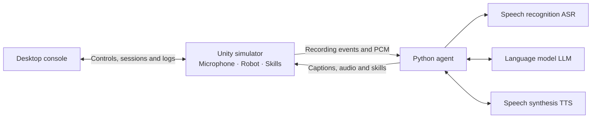

<p align="center">
  <a href="https://github.com/AgiBot-Community">
    
  </a>
</p>

<h1 align="center">X2 Agent Playground</h1>

<p align="center">
  <a href="../../README.md"></a>
  <a href="README.md"></a>
  <a href="../fr/README.md"></a>
</p>

<p align="center">
  A Unity simulation environment for the X2 humanoid robot, with a WebSocket gateway, robot skills, a Python voice agent and a desktop console.
</p>

<p align="center"><a href="https://unity.com/releases/editor/archive"></a> <a href="https://learn.microsoft.com/dotnet/csharp/"></a> <a href="https://www.python.org/"></a> <a href="../../LICENSE"></a> <a href="https://github.com/AgiBot-Community"></a> <a href="https://github.com/AgiBot-Community/Unity-Agent-Playground/issues"></a></p>

[Quick start](#quick-start) · [Configuration and skills](#configuration-and-skills) · [Controls and debugging](#controls-and-debugging) · [Troubleshooting](#troubleshooting) · [Development and builds](#development-and-builds) · [Documentation](#documentation)

## About the project

Unity captures microphone audio, displays the robot and executes skills. The agent receives audio over WebSocket, calls speech recognition (ASR), a large language model (LLM) and speech synthesis (TTS), then returns text, audio and skill commands. The example uses Doubao speech services and Volcengine Ark. Other clients can connect through the [gateway protocol](interface.md).

- **Robot skills:** waving, opening arms, walking, turning and facial expressions, with execution status and explicit interruption.
- **Voice interaction:** streaming recognition, model responses and synthesis; an offline demo checks connections and audio playback.
- **Management and debugging:** manual controls, session priorities, status monitoring and log export through the desktop console.
- **Sources and builds:** a Unity project, standalone Python examples and a Windows portable packaging tool.



The simulator, agent and console run as separate processes. The simulator alone can test skills. Add the agent for voice conversations, and the console for logs, priorities or manual control.

## Quick start

| Component | Requirements |
|---|---|
| Portable simulator | Windows 10/11 x64 |
| Unity sources | Unity Hub and Editor **2022.3.62f3c1** |
| Python agent / console | Python 3.10+; the console also requires Tkinter |
| Voice conversations | Microphone, speakers, Volcengine Speech and Ark API keys |

### Get the source

Download the EXE directly if you only need the portable simulator. For the Python examples, console or Unity project, clone the repository or download and extract its source ZIP:

```powershell
git clone https://github.com/AgiBot-Community/Unity-Agent-Playground.git
cd Unity-Agent-Playground
```

Commands below use Windows PowerShell and start at the repository root unless stated otherwise. Install dependencies and run scripts with the same Python environment.

### 1. Start the simulator

**Option A: portable Windows build**

1. Download `x2-simulator-windows-x64.exe` and the matching `.sha256` file from [GitHub Releases](https://github.com/AgiBot-Community/Unity-Agent-Playground/releases).
2. Open PowerShell in the download directory and compare the computed hash with the `.sha256` file:

   ```powershell
   Get-FileHash -LiteralPath '.\x2-simulator-windows-x64.exe' -Algorithm SHA256
   ```

3. Open the EXE and wait for the robot window. The first launch extracts resources under `%LOCALAPPDATA%\UnityPortable`; subsequent launches reuse the cache.
4. Press **F1** to open the debug panel and test skills. Python and cloud keys are not required for these buttons.

**Option B: Unity sources**

1. Install Unity Hub and Editor **2022.3.62f3c1**, as recorded in [ProjectVersion.txt](../../unity-agent-playground/ProjectSettings/ProjectVersion.txt). See the [Unity guide](unity.md) for installation.
2. Choose **Add project from disk** in Hub and select the inner `unity-agent-playground/` directory containing `Assets/`, `Packages/` and `ProjectSettings/`.
3. Wait for import and compilation, open `Assets/X02Competition/Scenes/scene.unity` and press **Play**.
4. Focus the Game window and press **F1** to inspect status. Press Play again to stop.

Both methods listen on `127.0.0.1:9002` by default. Run one simulator at a time.

### 2. Check the agent connection

Keep the simulator running. Open PowerShell at the repository root:

```powershell
cd example/x2_agent
python -m pip install -r requirements.txt
python demo.py
```

After `state=online` appears, wait for the greeting to finish, then speak and check captions and audio. The demo returns fixed text and bundled recordings without cloud calls or speech recognition. Missing or invalid recordings fall back to a tone. Press **Ctrl+C** to stop.

### 3. Configure voice conversations

Stop the demo with **Ctrl+C**. In the same `example/x2_agent/` terminal:

```powershell
if (-not (Test-Path .env)) { Copy-Item .env.example .env }
# Set DOUBAO_SPEECH_API_KEY and ARK_API_KEY in .env
python agent.py
```

Wait for the greeting to finish before speaking. Chinese examples include “你好” (hello), “挥挥手” (wave) and “往前走一米” (walk forward one metre). See the [agent guide](../../example/x2_agent/docs/en/README.md) for models, voices, options and troubleshooting.

`DOUBAO_SPEECH_API_KEY` authenticates ASR and TTS; `ARK_API_KEY` authenticates the LLM. Enable the corresponding services in your account. Store credentials in `example/x2_agent/.env` and keep them out of Git.

### Desktop console (optional)

In another terminal at the repository root:

```powershell
python -m pip install -r example/x2_console/requirements.txt
python example/x2_console/main.py
```

The console starts in monitoring mode. Enable action takeover for manual control. To use its simulator launch button, save the downloaded EXE as `exe/x2模拟器.exe` within the repository. See the [console guide](console.md).

1. Keep the simulator running and connect the console to `127.0.0.1:9002`.
2. Enable takeover in the sessions/priority tab before using manual robot controls.
3. Release takeover when using the voice agent for skills. The console keeps log access and priority management.

The console has fixed management priority `1000`; other clients can be set to `0–999`. Priorities reset on reconnect. Action control and microphone ownership are managed separately.

## Configuration and skills

The agent reads `.env` from its own project directory. For the settings below, precedence is **CLI arguments > existing environment variables > `.env` > built-in defaults**. See the [configuration template](../../example/x2_agent/.env.example).

| Setting | Purpose |
|---|---|
| `DOUBAO_SPEECH_API_KEY` | ASR / TTS credentials, required by the voice agent |
| `ARK_API_KEY` | LLM credentials, required by the voice agent |
| `DOUBAO_LLM_MODEL` | Model ID or Ark endpoint ID |
| `DOUBAO_TTS_SPEAKER` | Voice compatible with the selected TTS resource |
| `DOUBAO_ASR_RESOURCE_ID` | ASR resource ID |

Run from `example/x2_agent/`:

```powershell
# List all options
python agent.py --help
# Customize or disable the greeting
python agent.py --greeting "你好，我是导览机器人"
python agent.py --greeting=
# Save input and reply audio for troubleshooting
python agent.py --save-input input.wav --save-audio reply.wav
# Test a wave without cloud services
python demo.py --skill gesture/wave_hands
```

| Spoken request example | Skill | Behavior |
|---|---|---|
| “挥挥手” / “张开双臂” (wave / open arms) | `gesture/wave_hands`, `gesture/open_arms` | Play a gesture |
| “往前走一米” (walk forward one metre) | `movement/walk` | Move by `distanceM` |
| “向右转” (turn right) | `movement/turn` | Turn by `angleDeg`; positive is right |
| “做个开心的表情” (look happy) | `emotion/happy` | Change the face |
| “停” (stop) | `movement/stop` | Stop movement after recognition and skill dispatch |

The model in `agent.py` chooses skills for spoken requests. The demo tests skills through options and does not understand speech. Skills execute asynchronously and report `running`, `done` or `failed`. See the [protocol](interface.md) for all parameters and expressions.

## Controls and debugging

| Shortcut | Action |
|---|---|
| **F1** | Show or hide the Unity debug panel |
| **C** | Cycle camera views |
| **F2 / F3 / F4** | Overview / front follow / side follow |
| **F5** | Free orbit; right-drag to rotate, mouse wheel to change distance |
| **Ctrl+.** (console) | Stop movement and speech |
| **Ctrl+L** (console) | Search logs |

Unity runtime logs reach clients through the same WebSocket. The console filters by level, source and keyword, and exports JSONL. The agent and demo display logs in the terminal. Close the simulator window or stop Editor Play to end simulation; press Ctrl+C to stop the agent.

## Troubleshooting

| Symptom | Check |
|---|---|
| Connection refused | Start the simulator or Editor Play, check `127.0.0.1:9002` and close other instances using that port |
| Handshake `401` / `503` | Check credentials and timestamp for `401`; `503` means the connection limit was reached |
| Voice reply without movement | Check console takeover, agent action ownership and error `4091` |
| No recognition or playback | Check input/output devices, volume and mute; use `--save-input` and `--save-audio` |
| Saying “stop” during playback does nothing | Detection pauses in half-duplex mode; use the console stop button or an explicit interrupt |
| Console cannot find the EXE | Save the download as `exe/x2模拟器.exe`, or launch it manually and connect |

Remote connections require changing the Unity gateway's listen address and making the port reachable. An agent `--host` option alone does not change the gateway listener. See the [agent](../../example/x2_agent/docs/en/README.md) and [Unity](unity.md) guides for further diagnostics.

## Limitations

- Voice is half-duplex: after a recording is committed, detection pauses through recognition, response generation and playback. Listening resumes when the reply ends, on an explicit interrupt, or after 90 seconds without response progress.
- The gateway accepts eight connections by default. Only the selected voice client receives microphone audio. The console can adjust other clients' priorities.
- The default voice and prompt use Chinese. Documentation is available in Chinese, English and French; speech services and the Unity UI have their own language support.
- This is a simulation environment. Confirm device protocol and skill support before connecting real hardware.

## Repository layout

| Path | Contents |
|---|---|
| [unity-agent-playground/](../../unity-agent-playground/) | Unity project, robot models, skills and gateway |
| [example/x2_agent/](../../example/x2_agent/docs/en/README.md) | Python voice agent, offline demo and tests |
| [example/x2_console/](console.md) | Python desktop console and tests |
| [tools/unity-packager/](../../tools/unity-packager/README.md) | Windows portable packaging tool |
| [docs/](../README.md) | User guides, protocol reference and development documentation |

Portable executables and checksums are distributed through GitHub Releases. `exe/`, `build/` and `release/` hold local downloads and build output.

## Development and builds

Install the relevant Python dependencies, then run tests from the repository root:

```powershell
cd example/x2_agent
python -B -m unittest discover -s tests -v
cd ../x2_console
python -B -m unittest discover -s tests -v
cd ../..
```

These tests use local mock services without Unity or cloud credentials. The [development guide](development.md) covers Unity Play Mode, gesture, expression and multi-session checks.

After changing Unity sources, choose Windows x86_64 in **File → Build Settings**, include the main scene and build into a dedicated directory. A standard build contains the EXE and resource files. Package the full directory for single-file distribution. For a player named `UnityEnvironment.exe` built into `build/Windows/`:

```powershell
.\tools\unity-packager\pack-x2.ps1 `
  -Source ".\build\Windows" `
  -Output ".\release\x2-simulator-windows-x64.exe"
```

The packager also creates a `.sha256` file. Publish the EXE and matching checksum in the same GitHub Release. See the [packager guide](../../tools/unity-packager/README.md).

## Documentation

| Topic | 中文 | English | Français |
|---|---|---|---|
| Simulator and shortcuts | [运行指南](../zh-CN/simulator.md) | [Simulator](simulator.md) | [Simulateur](../fr/simulator.md) |
| Unity installation and builds | [Unity 工程](../zh-CN/unity.md) | [Unity project](unity.md) | [Projet Unity](../fr/unity.md) |
| Agent setup and troubleshooting | [Agent 指南](../../example/x2_agent/docs/zh-CN/README.md) | [Agent guide](../../example/x2_agent/docs/en/README.md) | [Guide de l’agent](../../example/x2_agent/docs/fr/README.md) |
| Desktop console | [控制台](../zh-CN/console.md) | [Console](console.md) | [Console](../fr/console.md) |
| Custom clients | [网关协议](../zh-CN/interface.md) | [Protocol](interface.md) | [Protocole](../fr/interface.md) |
| Tests and releases | [开发指南](../zh-CN/development.md) | [Development](development.md) | [Développement](../fr/development.md) |

## Contributing

Report bugs through [GitHub Issues](https://github.com/AgiBot-Community/Unity-Agent-Playground/issues), including your environment, reproduction steps and relevant logs. Submit code, documentation and translation changes through pull requests; see the [contributing guide](CONTRIBUTING.md).

The [development guide](development.md) covers modules, Python tests, Unity checks and releases. Browse all guides in the [documentation index](../README.md).

## License

Original project code is licensed under [Apache License 2.0](../../LICENSE). Third-party components and assets retain their accompanying licenses and notices.
