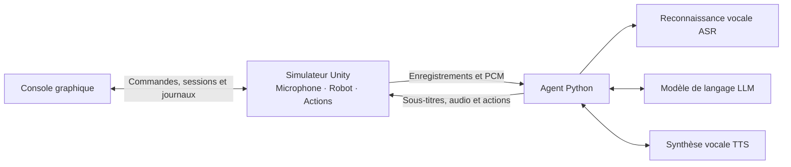

<p align="center">
  <a href="https://github.com/AgiBot-Community">
    
  </a>
</p>

<h1 align="center">X2 Agent Playground</h1>

<p align="center">
  <a href="../../README.md"></a>
  <a href="../en/README.md"></a>
  <a href="README.md"></a>
</p>

<p align="center">
  Un environnement de simulation Unity pour le robot humanoïde X2, avec une passerelle WebSocket, des actions robotiques, un agent vocal Python et une console graphique.
</p>

<p align="center"><a href="https://unity.com/releases/editor/archive"></a> <a href="https://learn.microsoft.com/dotnet/csharp/"></a> <a href="https://www.python.org/"></a> <a href="../../LICENSE"></a> <a href="https://github.com/AgiBot-Community"></a> <a href="https://github.com/AgiBot-Community/Unity-Agent-Playground/issues"></a></p>

[Démarrage rapide](#démarrage-rapide) · [Configuration et actions](#configuration-et-actions) · [Commandes et débogage](#commandes-et-débogage) · [Dépannage](#dépannage) · [Développement et compilation](#développement-et-compilation) · [Documentation](#documentation)

## Présentation du projet

Unity capture le microphone, affiche le robot et exécute les actions. L’agent reçoit l’audio par WebSocket, appelle la reconnaissance vocale (ASR), un grand modèle de langage (LLM) et la synthèse vocale (TTS), puis renvoie texte, audio et commandes. L’exemple utilise les services vocaux Doubao et Volcengine Ark. D’autres clients peuvent se connecter avec le [protocole de la passerelle](interface.md).

- **Actions robotiques :** salut, ouverture des bras, marche, rotation et expressions, avec état d’exécution et interruption explicite.
- **Dialogue vocal :** reconnaissance, réponses et synthèse en flux ; une démo hors ligne vérifie la connexion et la lecture audio.
- **Gestion et débogage :** commandes manuelles, priorités des sessions, surveillance et export des journaux dans la console.
- **Sources et compilation :** projet Unity, exemples Python autonomes et outil d’empaquetage Windows.



Le simulateur, l’agent et la console sont des processus distincts. Le simulateur seul permet de tester les actions. Ajoutez l’agent pour dialoguer, et la console pour les journaux, les priorités ou les commandes manuelles.

## Démarrage rapide

| Composant | Prérequis |
|---|---|
| Simulateur portable | Windows 10/11 x64 |
| Sources Unity | Unity Hub et éditeur **2022.3.62f3c1** |
| Agent / console Python | Python 3.10+ ; Tkinter est également requis pour la console |
| Dialogue vocal | Microphone, haut-parleurs, clés API Volcengine Speech et Ark |

### Obtenir les sources

Téléchargez directement l’EXE si vous utilisez uniquement le simulateur portable. Pour les exemples Python, la console ou le projet Unity, clonez le dépôt ou téléchargez et décompressez son archive ZIP :

```powershell
git clone https://github.com/AgiBot-Community/Unity-Agent-Playground.git
cd Unity-Agent-Playground
```

Les commandes suivantes utilisent Windows PowerShell depuis la racine du dépôt, sauf indication contraire. Utilisez le même environnement Python pour installer les dépendances et lancer les scripts.

### 1. Démarrer le simulateur

**Option A : version Windows portable**

1. Téléchargez `x2-simulator-windows-x64.exe` et le fichier `.sha256` correspondant depuis [GitHub Releases](https://github.com/AgiBot-Community/Unity-Agent-Playground/releases).
2. Ouvrez PowerShell dans le dossier de téléchargement et comparez l’empreinte calculée avec le fichier `.sha256` :

   ```powershell
   Get-FileHash -LiteralPath '.\x2-simulator-windows-x64.exe' -Algorithm SHA256
   ```

3. Lancez l’EXE et attendez la fenêtre du robot. Le premier lancement extrait les ressources dans `%LOCALAPPDATA%\UnityPortable` ; les suivants réutilisent le cache.
4. **F1** ouvre le panneau de débogage pour tester les actions. Ces boutons ne nécessitent ni Python ni clés cloud.

**Option B : sources Unity**

1. Installez Unity Hub et l’éditeur **2022.3.62f3c1**, indiqué dans [ProjectVersion.txt](../../unity-agent-playground/ProjectSettings/ProjectVersion.txt). Consultez le [guide Unity](unity.md) pour l’installation.
2. Dans Hub, choisissez **Add project from disk** et sélectionnez le dossier intérieur `unity-agent-playground/`, contenant `Assets/`, `Packages/` et `ProjectSettings/`.
3. Attendez l’import et la compilation, ouvrez `Assets/X02Competition/Scenes/scene.unity` et cliquez sur **Play**.
4. Activez la fenêtre Game et appuyez sur **F1** pour consulter l’état. Cliquez de nouveau sur Play pour arrêter.

Les deux méthodes écoutent sur `127.0.0.1:9002` par défaut. Exécutez un seul simulateur à la fois.

### 2. Vérifier la connexion de l’agent

Gardez le simulateur actif. Ouvrez PowerShell à la racine du dépôt :

```powershell
cd example/x2_agent
python -m pip install -r requirements.txt
python demo.py
```

Après l’affichage de `state=online`, attendez la fin de l’accueil, puis parlez et vérifiez les sous-titres et l’audio. La démo renvoie du texte fixe et lit les enregistrements fournis, sans appel cloud ni reconnaissance vocale. Un enregistrement absent ou invalide est remplacé par un signal sonore. **Ctrl+C** arrête le client.

### 3. Configurer le dialogue vocal

Arrêtez la démo avec **Ctrl+C**. Dans le même terminal `example/x2_agent/` :

```powershell
if (-not (Test-Path .env)) { Copy-Item .env.example .env }
# Renseigner DOUBAO_SPEECH_API_KEY et ARK_API_KEY dans .env
python agent.py
```

Attendez la fin de l’accueil avant de parler. Exemples en chinois : « 你好 » (bonjour), « 挥挥手 » (saluer), « 往前走一米 » (avancer d’un mètre). Le [guide de l’agent](../../example/x2_agent/docs/fr/README.md) décrit les modèles, voix, paramètres et solutions de dépannage.

`DOUBAO_SPEECH_API_KEY` authentifie ASR et TTS ; `ARK_API_KEY` authentifie le LLM. Activez les services correspondants sur votre compte. Conservez les clés dans `example/x2_agent/.env`, sans les versionner dans Git.

### Console graphique (facultative)

Dans un autre terminal, à la racine du dépôt :

```powershell
python -m pip install -r example/x2_console/requirements.txt
python example/x2_console/main.py
```

La console démarre en mode surveillance. Activez la prise de contrôle pour commander le robot manuellement. Pour utiliser son bouton de lancement du simulateur, enregistrez l’EXE téléchargé dans `exe/x2模拟器.exe` à la racine du dépôt. Consultez le [guide de la console](console.md).

1. Gardez le simulateur actif et connectez la console à `127.0.0.1:9002`.
2. Activez la prise de contrôle dans l’onglet sessions/priorités avant d’utiliser les commandes manuelles.
3. Cédez le contrôle lorsque l’agent vocal commande les actions. La console conserve les journaux et la gestion des priorités.

La priorité de gestion de la console reste `1000` ; les autres clients peuvent recevoir `0–999`. Les priorités sont réinitialisées à la reconnexion. Le contrôle des actions et l’attribution du microphone sont gérés séparément.

## Configuration et actions

L’agent lit `.env` dans son propre dossier de projet. Pour les paramètres ci-dessous, l’ordre est **arguments CLI > variables d’environnement existantes > `.env` > valeurs par défaut**. Consultez le [modèle de configuration](../../example/x2_agent/.env.example).

| Paramètre | Rôle |
|---|---|
| `DOUBAO_SPEECH_API_KEY` | Identifiants ASR / TTS, requis par l’agent vocal |
| `ARK_API_KEY` | Identifiants LLM, requis par l’agent vocal |
| `DOUBAO_LLM_MODEL` | Identifiant du modèle ou du point d’accès Ark |
| `DOUBAO_TTS_SPEAKER` | Voix compatible avec la ressource TTS |
| `DOUBAO_ASR_RESOURCE_ID` | Identifiant de la ressource ASR |

Depuis `example/x2_agent/` :

```powershell
# Afficher tous les paramètres
python agent.py --help
# Personnaliser ou désactiver l’accueil
python agent.py --greeting "你好，我是导览机器人"
python agent.py --greeting=
# Enregistrer les audios d’entrée et de réponse pour le diagnostic
python agent.py --save-input input.wav --save-audio reply.wav
# Tester un salut sans service cloud
python demo.py --skill gesture/wave_hands
```

| Exemple de demande vocale | Action | Comportement |
|---|---|---|
| « 挥挥手 » / « 张开双臂 » (saluer / ouvrir les bras) | `gesture/wave_hands`, `gesture/open_arms` | Jouer un geste |
| « 往前走一米 » (avancer d’un mètre) | `movement/walk` | Avancer selon `distanceM` |
| « 向右转 » (tourner à droite) | `movement/turn` | Tourner selon `angleDeg` ; positif vers la droite |
| « 做个开心的表情 » (afficher un visage heureux) | `emotion/happy` | Changer l’expression |
| « 停 » (arrêter) | `movement/stop` | Arrêter après reconnaissance et envoi de la commande |

Le modèle dans `agent.py` choisit les actions des demandes vocales. La démo teste les actions par paramètres, sans comprendre la parole. Les actions sont asynchrones et renvoient `running`, `done` ou `failed`. Le [protocole](interface.md) décrit tous les paramètres et expressions.

## Commandes et débogage

| Raccourci | Fonction |
|---|---|
| **F1** | Afficher ou masquer le panneau Unity |
| **C** | Changer de caméra |
| **F2 / F3 / F4** | Vue générale / suivi frontal / suivi latéral |
| **F5** | Orbite libre ; bouton droit pour tourner, molette pour la distance |
| **Ctrl+.** (console) | Arrêter les actions et la lecture vocale |
| **Ctrl+L** (console) | Rechercher dans les journaux |

Les journaux Unity arrivent par le même WebSocket. La console filtre par niveau, source et mot-clé et exporte en JSONL. L’agent et la démo affichent les journaux dans le terminal. Fermez la fenêtre du simulateur ou arrêtez le mode Play pour terminer la simulation ; Ctrl+C arrête l’agent.

## Dépannage

| Symptôme | Vérification |
|---|---|
| Connexion refusée | Lancer le simulateur ou le mode Play, vérifier `127.0.0.1:9002` et fermer les autres instances utilisant ce port |
| Connexion `401` / `503` | Pour `401`, vérifier identifiants et horodatage ; `503` indique la limite de connexions |
| Réponse vocale sans mouvement | Vérifier la prise de contrôle de la console, les droits de l’agent et l’erreur `4091` |
| Absence de reconnaissance ou de lecture | Vérifier périphériques, volume et sourdine ; utiliser `--save-input` et `--save-audio` |
| Dire « stop » pendant la lecture reste sans effet | Le mode semi-duplex suspend la détection ; utiliser le bouton d’arrêt ou une interruption explicite |
| La console ne trouve pas l’EXE | Enregistrer le fichier dans `exe/x2模拟器.exe`, ou le lancer manuellement avant la connexion |

Un accès distant nécessite de modifier l’adresse d’écoute de la passerelle Unity et de rendre le port accessible. L’option Agent `--host` seule ne modifie pas cette écoute. Consultez les guides de l’[agent](../../example/x2_agent/docs/fr/README.md) et de [Unity](unity.md) pour poursuivre le diagnostic.

## Limites

- Le dialogue est semi-duplex : la détection s’arrête pendant la lecture. Utilisez une interruption explicite ou la console pour arrêter la lecture.
- La passerelle accepte huit connexions par défaut. Seul l’agent vocal sélectionné reçoit le microphone. La console peut modifier les priorités des autres clients.
- La voix et le prompt par défaut sont en chinois. La documentation existe en chinois, anglais et français ; les services vocaux et l’interface Unity ont leur propre prise en charge linguistique.
- Ce projet est un environnement de simulation. Vérifiez le protocole et les actions disponibles avant de connecter du matériel réel.

## Organisation du dépôt

| Chemin | Contenu |
|---|---|
| [unity-agent-playground/](../../unity-agent-playground/) | Projet Unity, modèles, actions et passerelle |
| [example/x2_agent/](../../example/x2_agent/docs/fr/README.md) | Agent vocal Python, démo hors ligne et tests |
| [example/x2_console/](console.md) | Console graphique Python et tests |
| [tools/unity-packager/](../../tools/unity-packager/README.md) | Outil d’empaquetage Windows |
| [docs/](../README.md) | Guides, référence du protocole et documentation de développement |

Les exécutables portables et empreintes sont distribués via GitHub Releases. `exe/`, `build/` et `release/` contiennent les téléchargements et sorties de compilation locaux.

## Développement et compilation

Installez les dépendances Python correspondantes et lancez les tests depuis la racine du dépôt :

```powershell
python -B -m unittest discover -s example/x2_agent/tests -v
python -B -m unittest discover -s example/x2_console/tests -v
```

Ces tests utilisent des services simulés locaux, sans Unity ni clés cloud. Le [guide de développement](development.md) décrit les vérifications Unity Play Mode, gestes, expressions et sessions multiples.

Après modification des sources Unity, choisissez Windows x86_64 dans **File → Build Settings**, incluez la scène principale et compilez dans un dossier dédié. Une compilation standard contient l’EXE et ses ressources. Empaquetez tout ce dossier pour distribuer un seul fichier. Pour un Player nommé `UnityEnvironment.exe` produit dans `build/Windows/` :

```powershell
.\tools\unity-packager\pack-x2.ps1 `
  -Source ".\build\Windows" `
  -Output ".\release\x2-simulator-windows-x64.exe"
```

L’outil produit aussi un fichier `.sha256`. Publiez l’EXE et son empreinte dans la même GitHub Release. Consultez le [guide de l’outil](../../tools/unity-packager/README.md).

## Documentation

| Sujet | 中文 | English | Français |
|---|---|---|---|
| Simulateur et raccourcis | [运行指南](../zh-CN/simulator.md) | [Simulator](../en/simulator.md) | [Simulateur](simulator.md) |
| Installation et compilation Unity | [Unity 工程](../zh-CN/unity.md) | [Unity project](../en/unity.md) | [Projet Unity](unity.md) |
| Configuration et dépannage Agent | [Agent 指南](../../example/x2_agent/docs/zh-CN/README.md) | [Agent guide](../../example/x2_agent/docs/en/README.md) | [Guide de l’agent](../../example/x2_agent/docs/fr/README.md) |
| Console graphique | [控制台](../zh-CN/console.md) | [Console](../en/console.md) | [Console](console.md) |
| Clients personnalisés | [网关协议](../zh-CN/interface.md) | [Protocol](../en/interface.md) | [Protocole](interface.md) |
| Tests et publications | [开发指南](../zh-CN/development.md) | [Development](../en/development.md) | [Développement](development.md) |

## Contribuer

Signalez les problèmes dans [GitHub Issues](https://github.com/AgiBot-Community/Unity-Agent-Playground/issues), avec l’environnement, les étapes de reproduction et les journaux utiles. Les modifications du code, de la documentation et des traductions se proposent par pull request ; consultez le [guide de contribution](CONTRIBUTING.md).

Le [guide de développement](development.md) décrit les modules, tests Python, vérifications Unity et publications. Tous les guides figurent dans l’[index documentaire](../README.md).

## Licence

Le code original est distribué sous [Apache License 2.0](../../LICENSE). Les composants et ressources tiers conservent les licences et mentions qui les accompagnent.
